# @rbox/sync

`@rbox/sync` turns a directory into an encrypted manifest, compares versions, and applies the files needed to make another directory match. It is the client-side sync engine used by [rbox](https://rbox.to/).

The package scans files, plans a three-way reconcile, reads and writes encrypted blobs through a `BlobStore`, and handles rbox wire formats. It contains no network or server code. The rbox server is [`apps/api` in BrianVia/rbox-core](https://github.com/BrianVia/rbox-core/tree/main/apps/api).

Status: pre-release. Bun only (`bun >= 1.4`). The API is the engine rbox ships today and can change before 1.0.

## Source and mirror

The source is [`src/engine` in BrianVia/rbox-core](https://github.com/BrianVia/rbox-core/tree/main/src/engine). [BrianVia/rbox-sync](https://github.com/BrianVia/rbox-sync) is a read-only mirror of that folder, updated on every merge. Open issues and pull requests on rbox-core.

## How fast

End-to-end, or E2E, measurements include the rbox daemon, Cloudflare, and the network. Engine-only measurements exclude them. The stages below come from different dated runs, so do not add them unless the row states a total.

### Initial upload and first use on Device B

This path starts with the first publish of a folder on Device A and ends when a new Device B can use every file. The published E2E result was about 3 minutes 47 seconds for 120,000 files and 9.7 GB on the live v1.6.0 fleet on 2026-07-13. Older history continued in the background. See the [published result](https://rbox.to/) and [methodology](https://rbox.to/docs/).

Colors match the table: blue is Device A, orange is the server, green is Device B, gray is not measured. Only measured bars are to scale. Device A and Device B came from different dated runs, so the chart is a critical-path view, not one E2E total. Throughput measurements appear in the table and are not converted into invented durations.

```mermaid
%%{init: {"theme": "base", "themeVariables": {"activeTaskBkgColor": "#3b82f6", "activeTaskBorderColor": "#1d4ed8", "critBkgColor": "#f97316", "critBorderColor": "#c2410c", "doneTaskBkgColor": "#22c55e", "doneTaskBorderColor": "#15803d", "taskBkgColor": "#d1d5db", "taskBorderColor": "#6b7280", "taskTextColor": "#111827", "taskTextDarkColor": "#111827"}}}%%
gantt
    title Initial upload on A, then first usable files on B
    dateFormat x
    axisFormat %M:%S
    section Device A
    First publish, 2026-07-08 :active, init_a, 0, 599000
    section Server
    Admit initial commit (not measured) :init_server, 599000, 599001
    section Device B
    Setup to usable files, 2026-07-13 :done, init_b, 599001, 826001
```



| Stage | Who | Time | Source |
|---|---|---:|---|
| First publish | 🟦 Device A → 🟧 Server | 599 s | 2026-07-08, compiled dev build on a 32-core Linux host, 105,804 blobs in an 8.6 GB tree. [Design 81](https://github.com/BrianVia/rbox-core/blob/main/docs/design/81-worker-pool-crypto.md) |
| Encrypt reference workload | 🟦 Device A | 80.6 s for 2.77 GB ciphertext, about 275 Mbps | 2026-07-13, 16 threads and a 630 Mbps link. [Design 115](https://github.com/BrianVia/rbox-core/blob/main/docs/design/115-crypto-throughput.md) |
| Pack and upload | 🟦 Device A | 97 Mbps goodput across 36 packs | 2026-09-01, dev build pushing to the production API. Elapsed stage time was not reported. [STATUS](https://github.com/BrianVia/rbox-core/blob/main/docs/STATUS.md) |
| Packing comparison | 🟦 Device A | 48.8 Mbps before packing, 75–82 Mbps after | July 2026, small-blob upload with fewer requests. [Design 114](https://github.com/BrianVia/rbox-core/blob/main/docs/design/114-blob-packing.md) and [STATUS](https://github.com/BrianVia/rbox-core/blob/main/docs/STATUS.md) |
| Admit initial commit | 🟧 Server | Not measured | No initial-publish admission measurement is in the cited runs. |
| New-device setup to usable files, E2E | 🟩 Device B | About 3 min 47 s | 2026-07-13, live v1.6.0 fleet, 120,000 files and 9.7 GB. Older history attached later. [rbox methodology](https://rbox.to/docs/) |

### One small edit from Device A to Device B

The newest complete E2E run measured a median of about 11.7 seconds on 2026-08-16. It covered five desktop-to-Mac rounds with a 602-byte edit. Newer stage runs on 2026-08-18 measured a 1.5-second sender push and a 2.0-second desktop pull. The server admission figure is about 281 milliseconds from the live v1.6.0 fleet on 2026-07-13. These runs are not an additive breakdown of one event. See [STATUS](https://github.com/BrianVia/rbox-core/blob/main/docs/STATUS.md) and the [published methodology](https://rbox.to/docs/).

Colors match the table: blue is Device A, orange is the server, green is Device B, gray is not measured. Only measured bars are to scale. The gray end-to-end bar is a measured total from a separate run, not the sum of the stage bars.

```mermaid
%%{init: {"theme": "base", "themeVariables": {"activeTaskBkgColor": "#3b82f6", "activeTaskBorderColor": "#1d4ed8", "critBkgColor": "#f97316", "critBorderColor": "#c2410c", "doneTaskBkgColor": "#22c55e", "doneTaskBorderColor": "#15803d", "taskBkgColor": "#d1d5db", "taskBorderColor": "#6b7280", "taskTextColor": "#111827", "taskTextDarkColor": "#111827"}}}%%
gantt
    title One small edit from Device A to Device B
    dateFormat x
    axisFormat %S.%L
    section Device A
    Detect, encrypt, and pack (not measured) :edit_a_unknown, 0, 1
    Sender push, desktop 2026-08-18 :active, edit_push, 1, 1501
    section Server
    Admit commit, live fleet 2026-07-13 :crit, edit_admit, 1501, 1782
    Notify and schedule pull (not measured) :edit_notify, 1782, 1783
    section Device B
    Pull, desktop 2026-08-18 :done, edit_pull, 1783, 3783
    Decrypt and apply (not measured) :edit_apply, 3783, 3784
    section End to end
    E2E median, desktop to Mac 2026-08-16 :edit_e2e, 0, 11700
```



| Stage | Who | Time | Source |
|---|---|---:|---|
| Detect, encrypt, and pack | 🟦 Device A | Not measured | The cited run reports the push total, not these sub-stages. |
| Sender push | 🟦 Device A | 1.5 s median | 2026-08-18, desktop sender. [STATUS](https://github.com/BrianVia/rbox-core/blob/main/docs/STATUS.md) |
| One-file commit payload | 🟦 Device A | 614 B | 2026-07-26, one file in a 108,537-file workspace. [Design 204](https://github.com/BrianVia/rbox-core/blob/main/docs/design/204-delta-scoped-publish.md) |
| Admit commit | 🟧 Server | About 281 ms | 2026-07-13, server processing on the live v1.6.0 fleet. [rbox methodology](https://rbox.to/docs/) |
| Notify and schedule pull | 🟧 Server | Not measured | No isolated notification measurement is in the cited runs. |
| Pull | 🟩 Device B | 2.0 s median | 2026-08-18, desktop receiver. [STATUS](https://github.com/BrianVia/rbox-core/blob/main/docs/STATUS.md) |
| Decrypt and apply | 🟩 Device B | Not measured | The cited run reports the pull total, not these sub-stages. |
| Edit to applied, E2E | 🟦 Device A → 🟧 Server → 🟩 Device B | About 11.7 s median | 2026-08-16, five rounds, 602-byte edit, desktop to Mac. [STATUS](https://github.com/BrianVia/rbox-core/blob/main/docs/STATUS.md) |
| Older published fleet E2E | 🟦 Device A → 🟧 Server → 🟩 Device B | 16.7 s p50 | 2026-07-13, 233 live v1.6.0 events. [rbox methodology](https://rbox.to/docs/) |

### Engine-only benchmarks

These measurements exclude the daemon, server, and network.

| Work | Result | Conditions | Source |
|---|---:|---|---|
| Parallel directory walk | 528 ms serial, 149 ms with 16 slots, 3.5× faster | 2026-10-01, 50,000 files, warm cache, AMD Ryzen AI Max+ 395, ext4, Bun 1.4.2 | [`manifest-walk.ts`](https://github.com/BrianVia/rbox-core/blob/main/scripts/bench/manifest-walk.ts) |
| Delta manifest decode and fold | 464 ms, no measurable extra memory | 2026-10-01, 124,000 entries, same host. CI limit: 2 s | [`manifest-delta.bench.test.ts`](https://github.com/BrianVia/rbox-core/blob/main/src/engine/manifest-delta.bench.test.ts) |
| Batched watcher deletes | 1,401 ms before, 27 ms after, 52× faster | 2026-10-01 remeasurement, 124,000-entry manifest and 1,000 directory deletes | [Design 290](https://github.com/BrianVia/rbox-core/blob/main/docs/design/290-absent-delete-batching.md) |
| Fused encryption worker jobs | 10.0 s before, 1.3 s after, about 14,500 files/s | July 2026, 20,000 files, 410 MB, warm cache, Ryzen 9 5950X, ext4, Bun 1.3.14 | [Design 99](https://github.com/BrianVia/rbox-core/blob/main/docs/design/99-fused-crypto-worker-jobs.md) |
| Crypto worker count | 4 workers won 12 of 12 sweeps. Higher counts were 1.7–7× slower | 2026-07-27, x86 and Apple hardware with shipped defaults | [Default-on commit](https://github.com/BrianVia/rbox-core/commit/6a33b0c9d) |
| zstd before encryption | 2.17× smaller by bytes. Compress 300–740 MB/s, decompress 1–3.5 GB/s | July 2026, real tree with 110,743 files and 6.11 GiB, Apple M-series | [Design 79](https://github.com/BrianVia/rbox-core/blob/main/docs/design/79-compress-before-encrypt.md) |
| macOS bulk directory walk | 5.5 s before, 3.2 s after, 42% faster | 2026-07-12, warm full scan of 118,384 files, Apple arm64, APFS | [Design 107](https://github.com/BrianVia/rbox-core/blob/main/docs/design/107-darwin-bulk-scan.md) |

## Example

```ts
import {
  applyActions, buildIgnoreMatcher, encryptFileToTemp, generateKek,
  LocalBlobStore, reconcile, scanManifest, type Manifest,
} from "@rbox/sync";

const store = new LocalBlobStore("/tmp/store");
const local = await scanManifest("/data/src", buildIgnoreMatcher("/data/src"));
for (const f of local.files) {
  if (f.type === "file") await store.put(f.sha256, await Bun.file(`/data/src/${f.path}`).bytes());
}

const empty: Manifest = { generatedAt: new Date(0).toISOString(), files: [] };
await applyActions("/data/dst", reconcile(empty, empty, local, "device-b", new Date().toISOString()), store);

const kek = generateKek();
const blob = await encryptFileToTemp("/data/src/notes.md", kek); // blob.encSha addresses the ciphertext
```

The full runnable version is [`scripts/sync-package-example.ts`](https://github.com/BrianVia/rbox-core/blob/main/scripts/sync-package-example.ts).

## What is in the box

- **Scan and plan.** `scanManifest`, `buildIgnoreMatcher` with gitignore and `.rboxignore` semantics, `diffManifests`, and `reconcile`.
- **Apply.** `applyActions` against any `BlobStore` with `has`, `put`, `get`, and optional streaming.
- **Encryption.** Convergent AES-256-GCM blob encryption keyed by HKDF over a 32-byte key, optional zstd before encryption, recovery phrases, and a worker pool.
- **Wire formats.** Manifest delta envelopes, the small-blob pack format, and the E2EE signed-commit, roster, and key-epoch objects under `e2ee/`.

The package does not include the rbox server, transport, Git repository sync orchestration, or the daemon. The engine writes local caches under `.rbox/` in the synced root and never scans that directory.

## Run your own server on Cloudflare

This package is the client-side engine only. It has no network code. The server that stores blobs and orders commits is the rbox API, a Cloudflare Worker in [`apps/api`](https://github.com/BrianVia/rbox-core/blob/main/apps/api). You can deploy it to your account and point the rbox CLI at it. Billing and sign-in are optional and stay off.

You need a Cloudflare account with R2 enabled, and Bun. Plan on Workers Paid. Commit validation and the hourly maintenance job are likely to exceed the free plan's CPU limit.

1. Clone the repo and log in.
   ```sh
   git clone https://github.com/BrianVia/rbox-core && cd rbox-core && bun install
   cd apps/api && npx wrangler login
   ```
2. Create the database and buckets. Bucket names are global, so pick your own.
   ```sh
   npx wrangler d1 create my-rbox-db
   npx wrangler r2 bucket create my-rbox-blobs
   npx wrangler r2 bucket create my-rbox-releases
   ```
3. Edit the top-level block of `apps/api/wrangler.jsonc`. Do not deploy `env.production`, which is bound to `api.rbox.to`.
   - Set `name`, plus `database_name` and `database_id` from step 2. Keep the binding names.
   - Set both `bucket_name` values to your buckets.
   - Delete the `queues` and `send_email` blocks, or create the four queues they name. Both are optional.
4. Apply the schema.
   ```sh
   npx wrangler d1 migrations apply my-rbox-db --remote
   ```
5. Set secrets. Save the bootstrap secret, because you log in with it.
   ```sh
   openssl rand -hex 32 | npx wrangler secret put RBOX_BOOTSTRAP_SECRET
   openssl rand -hex 32 | npx wrangler secret put RBOX_RECEIPT_KEY
   openssl rand -hex 32 | npx wrangler secret put RBOX_GRANT_KEY
   openssl rand -hex 32 | npx wrangler secret put RBOX_PLATFORM_SECRET
   ```
   - `RBOX_RECEIPT_KEY` is required. Without it every upload fails.
   - `RBOX_GRANT_KEY` is a speed-up.
   - `RBOX_PLATFORM_SECRET` unlocks the admin routes.
6. Deploy, and note the `workers.dev` URL it prints.
   ```sh
   npx wrangler deploy
   ```
7. On each machine, install the CLI and point it at your server.
   ```sh
   curl -fsSL https://rbox.to/install.sh | sh
   echo 'export RBOX_API=https://<your-worker>.workers.dev' >> ~/.zshrc   # or your shell's profile
   ```
8. On the first machine, create your account and start syncing a folder.
   ```sh
   rbox login --bootstrap <bootstrap-secret> --plan pro
   rbox init
   ```
   Save the recovery phrase it shows. `--plan pro` sets a 250 GiB cap.
9. Add more machines with pairing. Run `rbox pair` on an enrolled machine. Then run the `rbox connect <token>` command it prints on the new machine.

Gotchas:

- **Locked account.** An account created without `--plan` gets a 1-byte storage cap, and every upload is refused. Fix it with the admin route:
  ```sh
  curl -X POST -H "x-rbox-platform: <platform-secret>" \
    "https://<your-worker>.workers.dev/v1/admin/account/<account-id>/plan?plan=pro"
  ```
- **Missing `RBOX_API`.** Without it, some commands quietly talk to the hosted `api.rbox.to` instead of your server.
- **Guard the bootstrap secret.** Anyone with it can create accounts on your server.
- **No browser sign-in.** Plain `rbox login` needs the hosted web app. Use `--bootstrap` for the first machine and pairing for the rest.
- **Upgrades.** `rbox upgrade` looks for releases on your server and fails. Re-run the install script instead.
- **Old history is never deleted.** Garbage collection and history pruning ship turned off. Storage only grows until you enable them.

## License

Apache-2.0.
